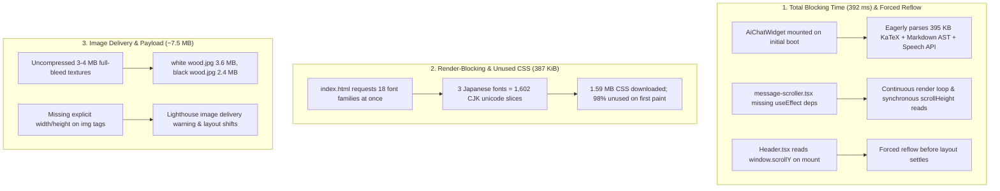

# Performance Audit & Bottleneck Analysis

This document outlines the core performance bottlenecks identified during Lighthouse audits (score baseline: 55–78) and the targeted architectural solutions to achieve a 95+ performance rating.

---

## 1. Problem Overview Diagram

---

## 2. Identified Bottlenecks

### A. Total Blocking Time (TBT: 392 ms) & Main-Thread Contention
* **Eager Chat Evaluation**: `<AiChatWidget>` mounted unconditionally on page load. Even though minimized, it pulled in 500+ KB of JavaScript (KaTeX engine, Markdown parsers, Web Speech API) and ran geometric layout measurements during boot.
* **Layout Thrashing in Scroll Viewport**: `message-scroller.tsx` lacked a dependency array on its auto-scroll `useEffect`, triggering repeated layout recalculations (`scrollHeight`, `scrollTop`) on every render.
* **Synchronous Mount Layout Queries**: `Header.tsx` read `window.scrollY` immediately upon mount before styles settled.
* **Non-Composited Animations**: SVG stroke animations (`stroke-dashoffset`) and un-promoted multi-layer blur filters (`blur-3xl`) forced CPU repaints on inactive elements.

### B. Monolithic Font Loading (387 KiB Unused CSS)
* **CJK Slicing Explosion**: Requesting 18 font families in a single Google Fonts URL caused Google Fonts to return 1,890 `@font-face` blocks (over 1.59 MB of raw CSS) due to ~120 unicode slices per Japanese font weight.
* **Single Active Variant**: The UI only displays one typography variant at a time (defaulting to Variant 4: *Bricolage Grotesque*, *DM Sans*, *JetBrains Mono*, *Space Grotesk*), rendering 98% of the loaded font rules unused on initial paint.

### C. Heavy Image Payloads & Missing Dimensions
* **Oversized Background Textures**: Full-bleed background textures were loaded as 3–4 MB uncompressed JPEGs.
* **Missing Intrinsic Dimensions**: Multiple `` elements lacked explicit `width` and `height` attributes, triggering Lighthouse image delivery flags.

---

## 3. Optimization Strategy (Target: 95+)

1. **Lazy-Mount AI Chat**: Extract the trigger button into the shell. Mount the heavy `AiChatWidget` and KaTeX runtime strictly on user click (`isOpen === true`).
2. **Eliminate Layout Thrashing**: Add missing dependency arrays to chat scrollers, guard header scroll queries, and promote continuous animations to hardware-composited layers.
3. **Lean Font Delivery**: Load only the active variant's fonts on first paint (~25 KB CSS vs 1.59 MB). Stream other variant fonts on-demand when switching typography styles.
4. **Image Attributes**: Supply explicit `width` and `height` attributes, `loading="lazy"`, and `decoding="async"` across all media elements.
