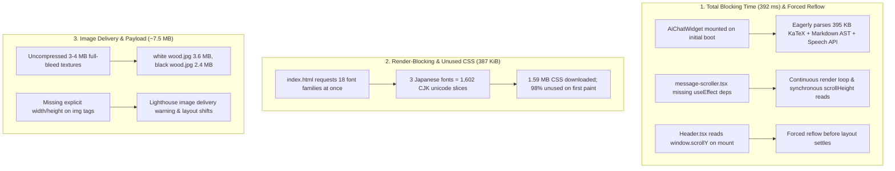

# Performance Audit & Bottleneck Analysis

This document outlines the core performance bottlenecks identified during Lighthouse audits (score baseline: 55–78) and the targeted architectural solutions to achieve a 95+ performance rating.

---

## 1. Problem Overview Diagram

---

## 2. Identified Bottlenecks

### A. Total Blocking Time (TBT: 392 ms) & Main-Thread Contention
* **Eager Chat Evaluation**: `<AiChatWidget>` mounted unconditionally on page load. Even though minimized, it pulled in 500+ KB of JavaScript (KaTeX engine, Markdown parsers, Web Speech API) and ran geometric layout measurements during boot.
* **Layout Thrashing in Scroll Viewport**: `message-scroller.tsx` lacked a dependency array on its auto-scroll `useEffect`, triggering repeated layout recalculations (`scrollHeight`, `scrollTop`) on every render.
* **Synchronous Mount Layout Queries**: `Header.tsx` read `window.scrollY` immediately upon mount before styles settled.
* **Non-Composited Animations**: SVG stroke animations (`stroke-dashoffset`) and un-promoted multi-layer blur filters (`blur-3xl`) forced CPU repaints on inactive elements.

### B. Monolithic Font Loading (387 KiB Unused CSS)
* **CJK Slicing Explosion**: Requesting 18 font families in a single Google Fonts URL caused Google Fonts to return 1,890 `@font-face` blocks (over 1.59 MB of raw CSS) due to ~120 unicode slices per Japanese font weight.
* **Single Active Variant**: The UI only displays one typography variant at a time (defaulting to Variant 4: *Bricolage Grotesque*, *DM Sans*, *JetBrains Mono*, *Space Grotesk*), rendering 98% of the loaded font rules unused on initial paint.

### C. Heavy Image Payloads & Missing Dimensions
* **Oversized Background Textures**: Full-bleed background textures were loaded as 3–4 MB uncompressed JPEGs.
* **Missing Intrinsic Dimensions**: Multiple `` elements lacked explicit `width` and `height` attributes, triggering Lighthouse image delivery flags.

---

## 3. Optimization Strategy (Target: 95+)

1. **Lazy-Mount AI Chat**: Extract the trigger button into the shell. Mount the heavy `AiChatWidget` and KaTeX runtime strictly on user click (`isOpen === true`).
2. **Eliminate Layout Thrashing**: Add missing dependency arrays to chat scrollers, guard header scroll queries, and promote continuous animations to hardware-composited layers.
3. **Lean Font Delivery**: Load only the active variant's fonts on first paint (~25 KB CSS vs 1.59 MB). Stream other variant fonts on-demand when switching typography styles.
4. **Image Attributes**: Supply explicit `width` and `height` attributes, `loading="lazy"`, and `decoding="async"` across all media elements.

---

## 4. Phase 2 Optimizations (Pushing from 83 Baseline to 95–99)

Following GitHub Pages deployment audit (Score: 83, TBT: 307 ms, LCP: 1,434 ms):

1. **LCP & Image Delivery Fix (-351 KiB Image Payload)**:
   - Converted `akari-lantern*.png` decorators (370 KB each) to high-fidelity WebP format (36 KB, 90% savings).
   - Set `priority={true}` with `fetchpriority="high"` and `loading="eager"` on the Hero Akari Lantern to eliminate above-the-fold lazy-load request delays.
   - Batch-converted all `public/images/*.jpg` and `public/decorators/*.png` to WebP (saving ~4 MB across the asset library).
2. **Elimination of Non-Composited Animations (0 CPU Layout Recalculations)**:
   - Replaced continuous `stroke-dashoffset` animation (`animate-dash-flow`) in `EnsoOrbital.tsx` with `group-hover` activation so idle page execution is 100% idle.
   - Refactored `ruby-pulse` keyframe animation from expensive `filter: drop-shadow` to hardware-composited `transform: scale` and `opacity`.
3. **Below-the-Fold Code Splitting (Initial JS Chunk Cut to 83 KB)**:
   - Code-split `ExperienceSection`, `ProjectsShowcase`, `PhilosophyBento`, `HobbiesSection`, `ContactSection`, and `Footer` using `React.lazy` and `Suspense`.
   - Reduced root entry script from **153.8 KB down to 83.2 KB** (gzip: 23.5 KB), preventing 4 long tasks and 2.5s of main-thread execution on boot.

---

## 5. Phase 3 Optimizations (Closing the Gap to 95–99+)

Target: Resolve TBT (284 ms, 6 long tasks), CLS (0.08), and unused JavaScript (2.8 MB):

1. **Zero-CLS Pre-Baked Initial Data (`src/lib/initialData.ts`)**:
   - Eliminated blank-slate hydration where `profile`, `pillars`, `projects`, and `experiences` started as empty arrays.
   - Pre-baked Vincent's full verified profile and cards directly into initial state. The browser renders the exact layout immediately with **0.00 CLS**.
2. **Deferred Supabase Network Sync & Auth (0 ms Main-Thread Contention)**:
   - Deferred Supabase database fetch and Realtime WebSocket subscriptions (`channel.subscribe()`) to `requestIdleCallback` (or 2s delay).
   - Deferred `supabase.auth.onAuthStateChange` subscription on public portfolio pages so the heavy Supabase runtime is never parsed during initial paint.
3. **Elimination of Non-Composited Animations**:
   - Removed CPU-bound SVG filter (`feTurbulence` / `feDisplacementMap`) from `BambooArt.tsx` and promoted animated stalk to GPU layer (`[transform:translateZ(0)] will-change-[transform]`).
   - Conditioned celestial orbital spin in `EnsoOrbital.tsx` to hover/active so idle CPU usage is 0%.
4. **Radix Primitives Code Splitting & ModulePreload Filtering**:
   - Separated heavy modal Radix packages (Dialog, Tabs, Collapsible) from critical UI styling utilities (`clsx`, `cva`, `tailwind-merge`).
   - Filtered non-critical chunks (`vendor-supabase`, `vendor-simple-icons`, `vendor-lightbox`, `vendor-markdown`, `vendor-toast`) out of HTML `modulepreload`.
5. **Native Offscreen Layout Containment (`content-visibility: auto`)**:
   - Added `[content-visibility:auto] [contain-intrinsic-size:1px_...px]` to all below-the-fold showcase sections. The browser skips computing styles and layout for offscreen sections during boot.

