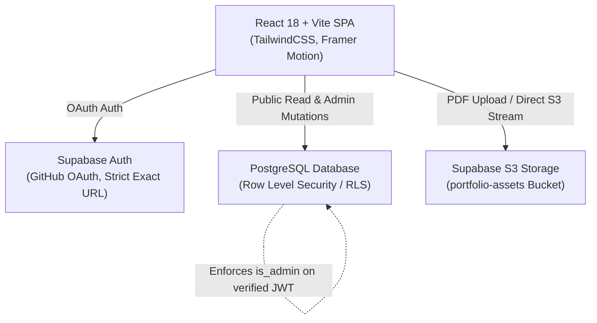

# Vincent Yuan — Distributed Systems & AI Engineer

[](https://vincentyuann.github.io/profolio)
[](https://react.dev/)
[](https://www.typescriptlang.org/)
[](https://tailwindcss.com/)
[](https://supabase.com/)

A bespoke dual-theme engineering portfolio joining the architectural restraint of Japanese *Wabi-Sabi*, *Ma* (intentional negative space), and *Shokunin* craftsmanship with high-performance distributed systems engineering.

Check out the live portfolio: [https://vincentyuann.github.io/profolio](https://vincentyuann.github.io/profolio)  
Reach out or say hi: [https://vincentyuann.github.io/profolio/#/contact](https://vincentyuann.github.io/profolio/#/contact)

---

## 🏛️ Design Philosophy & Visual System

* **Akari Day Mode**: Warm washi-paper canvas (`#F2E9DA`), fine tan hairlines, and softened charcoal-navy text reflecting daylight through shoji screens.
* **Obsidian Night Mode**: Deep blue-charcoal canvas (`#1E1F24`), graphite borders, and warm off-white typography creating a calm evening workbench.
* **Ensō Orbital Dynamics (`<EnsoOrbital />`)**: Calligraphic sumi-e ink wash ensō rings with rotating golden celestial orbits, pulsing vermilion rubies, and dust motes revealed exclusively on card hover (`hoverOnly={true}`) to preserve *Ma*.
* **Seigaiha Wave & Diamond Crest Dividers (`<SectionDivider />`)**: Hand-drawn wave arches (Seigaiha) paired with dashed hairline rules and concentric terracotta/ochre diamond crests.
* **Scattered Vertical Margin Bento Widgets (`<VerticalMarginWidget />`)**: Architectural *tategaki* typography, telemetry coordinates, and authentic square Hanko seal stamps (`原`, `寂`, `侘`, `墨`, `匠`, `明`, `道`, `創`, `整`, `証`, `記`) anchoring widescreen desktop viewports.
* **Classical Card Joinery (`.classical-card-frame`, `<CornerBrackets />`)**: Inset hairline framing and shifting corner L-brackets mimicking precision wood joinery.

---

## 🛠️ Architecture & Tech Stack



### Frontend
- **Framework**: React 18.3 + TypeScript 5.7
- **Bundler**: Vite 6.1 (configured for base `./` subpath deployment on GitHub Pages)
- **Styling**: Tailwind CSS with custom Akari color tokens & CSS custom properties
- **Typography**: Canela / Serif display headings, Montserrat sans-serif body, JetBrains Mono code & metadata
- **Icons & Micro-Graphics**: `lucide-react`, inline SVGs, vectorized Hanko stamps, Seigaiha waves

### Backend & Cloud
- **Database**: PostgreSQL on Supabase with strict Row Level Security (RLS) policies
- **Storage**: S3-backed Supabase Storage (`portfolio-assets` bucket)
- **Authentication**: GitHub OAuth with cryptographically verified JWT checking `is_admin()` against `vincentyuan1020@gmail.com`

---

## 📂 Core Pages & Capabilities

| Page / Section | Key Highlights |
| :--- | :--- |
| **`#home`** | Full-bleed panoramic sumi-e landscape banner, pine tree (*Matsu* 松) flank, featured projects showcase, work experience chronology, architectural philosophy bento, and contact form with live rate limiting. |
| **`#projects`** | Complete catalog of distributed microservices and generative AI runtimes with real-time tag search, category filtering, monochrome `<TechTag />` badges, and in-depth architecture modal inspection. |
| **`#resume`** | Dual-mode interactive viewer with live PDF streaming from S3 storage and syntax-highlighted LaTeX source code editor with instant copy/download. |
| **`#edit`** *(Admin)* | Full CMS suite with live in-place editors for Intro, Experience, Projects, Philosophy, and Resume, featuring per-item and global saves with instant `sonner` toast confirmations. |

---

## 🚀 Local Development

```bash
# Clone the repository
git clone https://github.com/VincentYuann/VincentYuann.git
cd VincentYuann

# Install dependencies
npm install

# Configure environment variables (.env.local)
VITE_SUPABASE_URL=your_supabase_url
VITE_SUPABASE_ANON_KEY=your_supabase_anon_key
VITE_ADMIN_EMAIL=vincentyuan1020@gmail.com

# Start Vite development server
npm run dev

# Build for production
npm run build
```

---

## 📄 License
MIT © [Vincent Yuan](https://github.com/VincentYuann)
