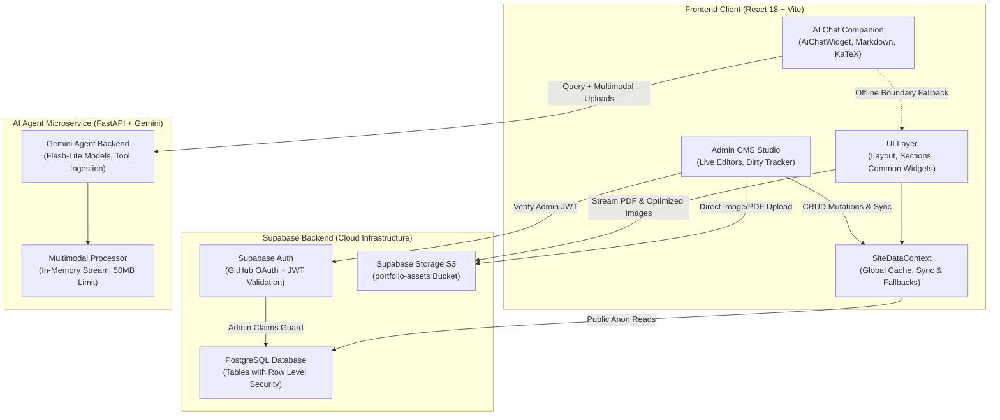

# Vincent Yuan: Software Engineering Portfolio

[](https://vincentyuann.github.io/portfolio)
[](https://react.dev/)
[](https://www.typescriptlang.org/)
[](https://tailwindcss.com/)
[](https://supabase.com/)

A modern, dynamic personal portfolio combining Japanese *Wabi-Sabi* aesthetics (*Ma* negative space, sumi-e ink wash, Hanko seals) with high-performance full-stack web engineering.

🔗 **Live Portfolio**: [https://vincentyuann.github.io/portfolio](https://vincentyuann.github.io/portfolio)

---

## 🏛️ System Architecture & Data Flow

The application is structured as a reactive Single Page Application (SPA) powered by React 18, Vite, Supabase, and a companion AI Agent microservice. Public visitors enjoy fast, cached reads, while verified admin sessions enable live in-browser CMS modifications.



### 🔄 Frontend & Backend Interactions

1. **Public Reads & Resilient Fallbacks**:
   - The frontend queries Supabase PostgreSQL tables (`projects`, `experience`, `profile`, `philosophy_pillars`) using the anonymous public client key.
   - If offline or experiencing network delays, `SiteDataContext` seamlessly falls back to bundled schemas and `localStorage` caching to guarantee zero visual interruption.

2. **Authenticated Admin Operations**:
   - The Admin Studio (`#edit`) authenticates via GitHub OAuth.
   - PostgreSQL Row Level Security (RLS) policies cryptographically verify the JWT claims against the administrator's designated email address before granting write permissions (`INSERT`, `UPDATE`, `DELETE`).

3. **Storage & Assets Management**:
   - Resume PDF documents and hobby photo galleries are uploaded directly to the S3-backed Supabase `portfolio-assets` bucket with strict content-type validations and size constraints.
   - The client streams assets with automatic error-fallback handlers (`handleImageError`) to ensure robust media rendering.

---

## 🤖 Vincent's AI Companion & Agent Microservice

The portfolio embeds an interactive engineering assistant (`<AiChatWidget />`) designed around Wabi-Sabi artisan principles and powered by a dedicated Python microservice:
- **Server-Side Knowledge Aggregation (`supabase/get_portfolio_ai_context.sql`)**: PostgreSQL RPC function `public.get_portfolio_ai_context()` serves structured, canonical context (`profile`, `projects`, `experience`, `philosophy_pillars`) directly to the AI agent, stripping heavy image assets and internal database IDs in-engine for maximal token efficiency.
- **Admin Database Copilot & Semantic SQL (`supabase/execute_admin_sql.sql`)**: For verified administrators, the agent can understand uploaded resumes, spec images, or text instructions, generate safe SQL with 1-to-1 fidelity on instructed fields and aesthetic semantic inference on omitted fields, executing via `public.execute_admin_sql` with zero personal access tokens (`sbp_...`).
- **Admin Speech-to-Text Voice Dictation**: Verified administrators can dictate prompt queries via microphone using a dedicated dictation button powered by `react-speech-recognition` with real-time speech feedback and continuous transcribing.
- **Live Real-Time Synchronization**: Any database mutation executed by the AI immediately updates the portfolio in the browser via Supabase Realtime CDC (`postgres_changes`) and eager client synchronization.
- **3-Layer Security & Leak Protection**: Guests and regular users receive role-isolated prompts with zero database schema exposure, and administrative SQL tools are excluded from their session both at the LLM tool declaration and server verification levels.
- **Automated Database Webhook Invalidation**: Schema mutations (`INSERT`, `UPDATE`, `DELETE`) trigger Supabase Database Webhooks targeting the AI service (`/api/v1/webhook/supabase-invalidate`), keeping the server RAM cache synchronized without frontend coupling.
- **Multimodal Uploads & Verification**: Accepts images (`PNG`, `JPEG`, `WEBP`, `GIF`) and documents (`PDF`, `DOCX`, `DOC`) up to 50 MB, streaming in-memory without disk temporary files.
- **Intelligent Architectural Synthesis**: Integrates Google Gemini (`gemini-3.5-flash-lite` / `gemini-3.1-flash-lite`) to answer technical inquiries about distributed systems, projects, latency optimization, and artisan craft.
- **Graceful Boundary Fallback**: If the microservice is temporarily unreachable, the frontend automatically falls back to an offline architectural knowledge base.
- **Decoupled Architecture**: All backend agent pipelines, tool definitions, test suites, and deployment manifests are maintained in the companion **AI Agent** microservice repository.

---

## 📂 Component & Code Organization

The codebase cleanly separates **universal shell/layout elements**, **reusable visual widgets**, **atomic UI primitives**, and **domain-specific feature sections**:

```
src/
├── components/
│   ├── layout/            # Universal Shell (Header, Footer, Toast notifications)
│   ├── common/            # Shared Wabi-Sabi elements (AiChatWidget, EnsoOrbital, SectionHeading, etc.)
│   ├── ui/                # Headless UI & Chat primitives (Button, Dialog, Badge, ChatBubble, etc.)
│   ├── sections/          # Domain-specific feature modules
│   │   ├── hero/          # Identity banner & Hanko card
│   │   ├── projects/      # Projects showcase, catalog page & architecture modal
│   │   ├── experience/    # Career trajectory milestones & timeline
│   │   ├── philosophy/    # Architectural pillars & engineering craft bento
│   │   ├── hobbies/       # Photo gallery archive, filter pills & hobby cards
│   │   ├── contact/       # Contact form & correspondence
│   │   ├── resume/        # S3 PDF stream viewer & live LaTeX editor
│   │   └── auth/          # Admin authentication modal
│   └── admin/             # Isolated Admin CMS Studio & editor sections
├── context/               # SiteDataContext & Supabase real-time synchronization
├── lib/                   # Supabase client, aiAgentApi, constants, and helper utilities
└── data/                  # TypeScript interfaces and fallback datasets
```

---

## 🛠️ Tech Stack

| Category | Technology |
| :--- | :--- |
| **Frontend** | React 18, TypeScript, Tailwind CSS, Vite 6, Lucide Icons, Sonner, KaTeX, React Markdown |
| **Backend & Auth** | Supabase (PostgreSQL, Row Level Security, GitHub OAuth) |
| **AI Microservice** | Python FastAPI, Google Gemini SDK, Gemini Files API (maintained in companion repo) |
| **Storage & Media** | Supabase Storage (S3-compatible bucket for images & PDF CVs) |
| **Deployment** | GitHub Pages with GitHub Actions CI/CD |

---

## 🚀 Getting Started

```bash
# 1. Clone the repository
git clone https://github.com/VincentYuann/portfolio.git
cd portfolio

# 2. Install dependencies
npm install

# 3. Set up environment variables (.env.local)
VITE_SUPABASE_URL=your_supabase_project_url
VITE_SUPABASE_ANON_KEY=your_supabase_anon_key
VITE_ADMIN_EMAIL=your_admin_email

# 4. Start local development server
npm run dev

# 5. Build for production
npm run build
```

---

## 📄 License

MIT © [Vincent Yuan](https://github.com/VincentYuann)
