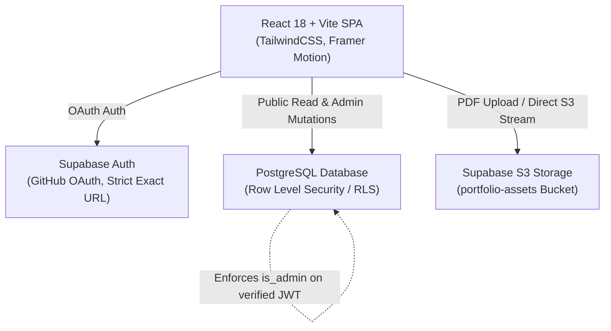
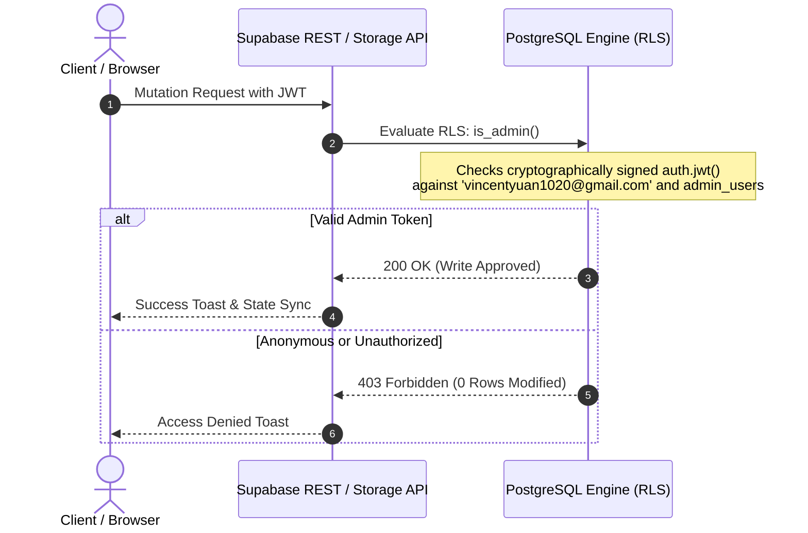

# Vincent Yuan Portfolio — Product Specification & System Architecture

## 1. Product Vision & Principles

The **Vincent Yuan Portfolio** is a high-performance web experience for **Vincent Yuan, Distributed Systems & Generative AI Engineer**. It combines the restraint and tactile elegance of Japanese editorial design (*Wabi-Sabi*, *Ma*, *Shokunin*) with the precision and depth of modern distributed systems engineering.

### Core Tenets
1. **Ma (間 — Intentional Space)**: Negative space is an active architectural element. Screens and cards remain calm and uncluttered until interaction triggers purposeful details.
2. **Shokunin (職人 — Artisan Precision)**: Every component, border joinery, and data interface is crafted with rigorous attention to detail.
3. **Dual-Theme Equilibrium**: Two equal, fully-developed themes—**Akari Day Mode** (warm washi paper, sumi ink, ochre hairlines) and **Charcoal Night Mode** (deep obsidian slate, warm off-white ink, graphite borders).

---

## 2. System Architecture & Tech Stack

### Frontend Stack
* **Framework**: React 18.3 + TypeScript 5.7
* **Build Tool**: Vite 6.1 (configured for base `./` subpath deployment)
* **Styling**: TailwindCSS 3.4 with custom Akari color tokens & CSS custom properties
* **Icons & Micro-Graphics**: `lucide-react`, inline Seigaiha waves, Hanko seal stamp, and Ensō orbital animations
* **Notifications**: `sonner` with inverse theme styling

### Backend & Cloud Infrastructure
* **Database**: Supabase PostgreSQL
* **Storage Engine**: S3-backed Supabase Storage (`portfolio-assets` bucket)
* **Authentication**: Supabase Auth via GitHub OAuth with strictly enforced exact-match URL allowlist
* **Authorization**: Dual-layer defense (PostgreSQL Row Level Security + frontend admin route guard)

---

## 3. Core Modules & Page Layout

### 01. Home (`#home`)
* **Hero Banner**: Full-bleed Sumi-e landscape art blended with edge radial masks, anchored by a high-contrast Japanese Pine Tree (*Matsu* 松), dynamic capability ribbon, and call-to-action buttons.
* **Seigaiha & Diamond Crest Section Dividers (`<SectionDivider />`)**: Hand-drawn layered wave surges (Seigaiha motif) perched above a dashed hairline rule flanked by concentric terracotta/ochre diamond crests with center dots and Japanese/English section descriptors.
* **Featured Projects Showcase**: Curated top engineering projects featuring `.classical-card-frame` double hairline joinery, shifting `.corner-bracket` accents, and hover-exclusive Ensō orbital blooms (`hoverOnly={true}`).
* **Work Experience Timeline**: Structured engineering roles with company badges, date chips, and clean bullet lists.
* **Architectural Philosophy Bento**: 3 core tenets with kanji watermarks and design manifestos, flanked by full-width misty landscapes and swaying bamboo illustrations.
* **Scattered Vertical Floating Widgets**: Architectural marginalia (`VerticalMarginWidget`) featuring Japanese calligraphy (*tategaki*), coordinates, and authentic square Hanko seal stamps.
* **Initiate a Dialogue (Contact)**: Direct message dispatching to `contact_messages` table with client-side and database-level rate limiting.

### 02. Projects Archive (`#all-projects` / `#projects`)
* Complete catalog of distributed systems, generative AI runtimes, and creative tech projects.
* Real-time category filtering and search query matching.
* **`<VerticalMarginWidget />` Flanks**: Left `余白の調和 // HARMONY` (`墨`) and Right `コードの魂 // DIGITAL CRAFT` (`道`) with lower minimal hairline (`創`).
* **`<TechTag />`**: Unified monochrome tech stack badges with domain-specific icons from `lucide-react` (AI, Systems, Web, Data).
* **System Architecture Modal**: In-depth modal breakdown detailing engineering highlights, architecture decisions, and repository/live deployment links.

### 03. Resume & LaTeX System (`#resume` / `#cv`)
* **Dual-Mode Interactive Viewer**:
  * **Interactive PDF View**: Streams live resume PDF from Supabase S3 storage (`portfolio-assets/resumes/vincent-yuan-cv.pdf`).
  * **LaTeX Source Code Editor**: Full syntax-highlighted LaTeX source code with real-time copy and download capabilities, synchronized with Supabase `resume_latex` table.
* **`<VerticalMarginWidget />` Flanks**: Left `沈黙と静寂 // SEI & JAKU` (`侘`) and Right `経歴の記録 // CURRICULUM VITAE` (`記`) with lower minimal hairline (`証`).

### 04. Admin Live Edit Dashboard (`#edit` — Admin Only)
* Secure, real-time portfolio management accessible exclusively to the verified portfolio owner (`vincentyuan1020@gmail.com`).
* **`<VerticalMarginWidget />` Flanks**: Left `匠の精緻 // SHOKUNIN` (`匠`) and Right `簡素の極み // SIMPLICITY` (`明`) with lower minimal hairline (`整`).
* **5 Dedicated Live Editors**:
  1. **Intro & Profile**: Headline, tagline, capability pillars ribbon, social links (`Save Profile`).
  2. **Experience**: Work history, roles, date ranges, bullets, and technology tags (`Save Experience`).
  3. **Projects**: Project cards, descriptions, architecture points, metrics, and tags (`Save Project` per item, `Save All Projects` global).
  4. **Resume**: Live LaTeX source editor with Supabase database persistence (`Save LaTeX Source`, `Save & Publish PDF`).
  5. **Philosophy**: Kanji, Romaji, title, taglines, and core tenet descriptions (`Save Philosophy Pillars`).
* **Sticky Sub-Navigation Bar**: Horizontal scrolling pill bar on mobile with short labels (`Intro`, `Projects`, `Exit`), and full labels on desktop.
* **Live Database Syncing & Toast Feedback**: Optimistic updates and instant `sonner` toast confirmations on saves and deletions.

---

## 4. Security & Row Level Security (RLS) Specification

### Security Measures:
1. **Server-Side PostgreSQL RLS**: All mutation operations (`INSERT`, `UPDATE`, `DELETE`, `ALL`) on `profile`, `profile_info`, `philosophy_pillars`, `experience`, `projects`, `resume_latex`, and `storage.objects` are guarded by `public.is_admin()`.
2. **Cryptographic JWT Validation**: `is_admin()` inspects the verified `auth.jwt() ->> 'email'`, preventing client-side spoofing or state tampering.
3. **Exact-Match OAuth Redirection (Zero Wildcards)**:
   * Production: `https://vincentyuann.github.io/VincentYuann/`
   * Development: `http://localhost:5173/`
4. **Dynamic Redirect URL Computation**: `getOAuthRedirectUrl()` in `src/lib/supabase.ts` dynamically detects GitHub Pages subpath vs. localhost environment.

---

## 5. UI/UX Standards

* **Zero-Flash Theme Booting**: Inline blocking script in `index.html` `<head>` synchronously reads `localStorage` before first paint, eliminating Flash of White Content (FOWC).
* **Inverse High-Contrast Toasts**:
  * Day mode page renders dark obsidian toasts for maximum pop against washi canvas.
  * Night mode page renders warm washi toasts for luminous pop against dark canvas.
* **Persistent Hash Navigation**: Refreshing on `#resume`, `#projects`, or `#edit` preserves the active page without booting back to `#home`.
* **Dynamic Admin Navbar (`06 Edit`)**: Appears automatically in the navigation bar when authenticated as administrator.
